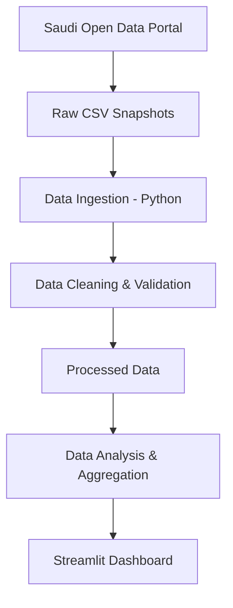

# Saudi Foreign Aid Pipeline — Data Architecture

```mermaid
flowchart TD
    A["Saudi Open Data Portal"] --> B["Raw CSV Snapshots"]
    B --> C["Data Ingestion - Python"]
    C --> D["Data Cleaning & Validation"]
    D --> E["Processed Data"]
    E --> F["Data Analysis & Aggregation"]
    F --> G["Streamlit Dashboard"]
```
